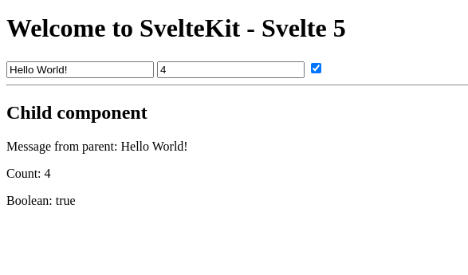

# Runas en Svelte 5
En Svelte 5, las runas son funciones especiales que comienzan con un símbolo de dólar ($). Estas runas le indican al compilador de Svelte cómo manejar ciertos aspectos reactivos de los componentes. El término "runa" proviene de un concepto mágico que denota algo con poderes especiales.

# Runa: $props()
La runa $props() es una característica introducida en Svelte 5 que facilita la gestión de las propiedades (props) en los componentes Svelte de una manera más dinámica y flexible.


# API pública de un componente

Svelte usa el rune `$props` para declarar _propiedades_ o _props_, lo que significa describir la interfaz pública del componente que se vuelve accesible para los consumidores del componente.

> `$props` es uno de varios runes, que son pistas especiales para el compilador de Svelte para hacer que las cosas sean reactivas.


## 1. ¿Qué es $props() en Svelte 5?
La runa $props() es una función especial que permite acceder a todas las propiedades pasadas a un componente como un objeto. En versiones anteriores de Svelte, para acceder a los props, debíamos exportar explícitamente cada propiedad con `export let propName;`. Con $props(), podemos acceder a todas las propiedades de una sola vez sin necesidad de exportarlas individualmente.


## 2. 2. Sintaxis y Uso
Componente Hijo (Child.svelte)
```sveltehtml
<script>
	let { message, count, boolean } = $props();

	// Values that are passed in as props
	// are immediately available
	console.log({ message, count, boolean });
</script>


<div>
	<h2>Child component</h2>
	<p>Message from parent: {message}</p>
	<p>Count: {count}</p>
	<p>Boolean: {boolean}</p>
	<p></p>
</div>
```

Componente Padre (Parent.svelte)
```sveltehtml
<script>

	import Child from './Child.svelte';
	let message = 'Hello from the parent';
	let count = 0;
	let boolean = true;
</script>


<h1>Welcome to SvelteKit - Svelte 5</h1>
<input type="text" bind:value={message} />
<input type="number" bind:value={count} />
<input type="checkbox" bind:checked={boolean} />

<hr>
<Child {message} {count} {boolean}/>
```

En el componente hijo, usamos la runa $props() para acceder a las propiedades `message`, `count`, y `boolean` que se pasan desde el componente padre. Estas propiedades están disponibles inmediatamente y se pueden utilizar en el componente hijo sin necesidad de exportarlas explícitamente.



## 3. Propiedades Predeterminadas
Puedes especificar un valor predeterminado para una prop. Se usará si el consumidor del componente no especifica la prop en el componente al instanciar el componente, o si el valor pasado es `undefined` en algún momento.

```sveltehtml
<script>
    let { foo = 'optional default initial value' } = $props();
</script>
```

## 4. Propiedades Restantes
Para obtener todas las propiedades, usamos la sintaxis con el operador rest (`...`).

```sveltehtml
<script>
    let { a, b, c, ...everythingElse } = $props();
</script>
```

## 5. Palabras Reservadas
Podemos usar palabras reservadas como nombres de propiedades.

```sveltehtml
<script>
    let { class: className } = $props();
</script>
```

## 6. Tipos de Propiedades
Si usamos TypeScript, podemos declarar los tipos de propiedades:

```sveltehtml
<script lang="ts">
    interface Props {
        required: string;
        optional?: number;
        [key: string]: unknown;
    }

    let { required, optional, ...everythingElse }: Props = $props();
</script>
```

Si usamos JavaScript, podemos declarar los tipos de propiedades usando JSDoc:

```sveltehtml
<script>
    /** @type {{ x: string }} */
    let { x } = $props();

    // or use @typedef if you want to document the properties:

    /**
     * @typedef {Object} MyProps
     * @property {string} y Some documentation
     */

    /** @type {MyProps} */
    let { y } = $props();
</script>

```

## 7. Exportación de Constantes, Clases o Funciones
Si exportas una constante, clase o función, es de solo lectura desde fuera del componente.

```sveltehtml
<script>
    export const thisIs = 'readonly';
</script>
```

```sveltehtml
<script>
    export function greet(name) {
        alert(`hello ${name}!`);
    }
</script>

```


